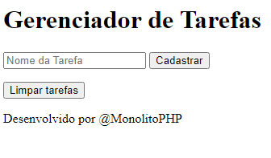
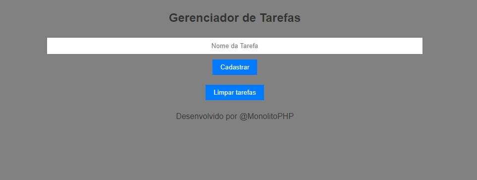

# 🚀 Projeto - Gerenciador de Tarefas

# Página inicial

# Página atualizada

## Status do Projeto🚧
> 🚧Projeto em andamento🚧

## 📋Descrição
Projeto desenvolvido para disciplina de Programação Web II. Copiamos um gerenciador de tarefas do Monolito PHP, um sistema para adicionar tarefas e gerenciar seu tempo. Estamos utilizando a linguagem PHP, HTML 5 e CSS3 ensinada em aula com o professor Leonardo Rocha.

## 🔧 Funcionalidades dentro do PHP
- `Isset`: É um função nativa do PHP que serve para saber se uma variável está definida
- `$SESSION`: É uma variável superglobal que é usada para armazenar informações de sessão do usuário
- `Foreach`: É uma estrutura de controle utilizada em PHP para iterar sobre arrays ou objetos. Ele permite percorrer todos os elementos de um array ou as propriedades de um objeto de forma simples e eficiente.
- `Session_start()`: Inicia uma nova sessão ou resume uma sessão existente, permitindo que você armazene e acesse variáveis de sessão
- `Array()`: É uma função interna que cria um novo array. O array() é utilizado para criar arrays em PHP, que são estruturas de dados que permitem armazenar múltiplos valores em uma única variável.
- `$_GET`: É uma superglobal em PHP que é usada para coletar dados enviados para o script via parâmetros de URL. Quando um formulário é enviado com o método GET, os campos do formulário são anexados à URL na forma de uma query string.
- `array_push()`: A função em PHP é utilizada para adicionar um ou mais elementos no final de um array. Ela aceita dois argumentos obrigatórios: o primeiro é o array no qual os elementos serão adicionados, e o segundo (e subsequentes) são os elementos que serão adicionados ao final do array.
- `var_dump()`: A função em PHP é usada para exibir informações sobre uma ou mais variáveis, incluindo seu tipo e valor. Ela é especialmente útil para depuração e diagnóstico de código, pois permite ver exatamente como uma variável está estruturada.
- `unset()`: É utilizada em PHP para destruir uma variável especificada. Isso significa que a variável deixará de existir e seu conteúdo será removido da memória.

### 🛠️ Tecnologia ultilizadas
 |  <> |  | |  |
| :---: | :---: | :---: | 

## 📄 Fontes consultadas
MonolitoPHP [https://www.youtube.com/watch?v=dJ49I-QYYUk&ab_channel=MonolitoPHP]

## ✒️ Autores
| [ Hanelise Naves Amorim](https://github.com/hiseamorim) |  [ Leonardo Rocha](https://github.com/LeonardoRochaMarista) |  [ Marista Escola Social Ir. Acácio](https://github.com/MaristaIrAcacio) |
| :---: | :---: | :---: |